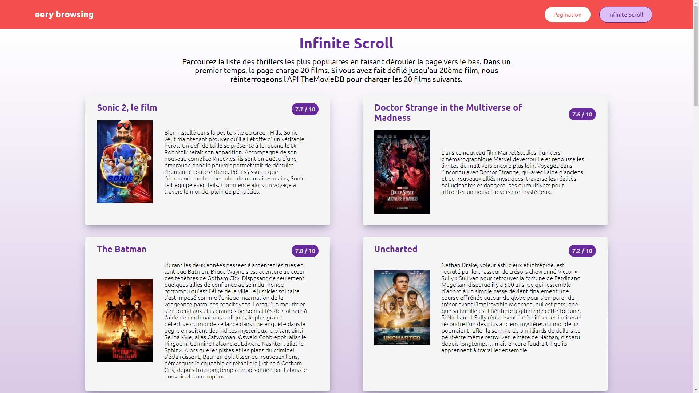

# Eery-Browsing :movie_camera:

## Introduction 📝

This project has been developed for learning purposes.  
Small application to browse a list of thriller movies in two ways: paginalted list or Infinite Scroll.  
Based on TheMovieDB API.
Vue front-end + Node backend.




## Project details 🔍

## Stack :wrench:

### Backend

* NodeJS v16.14.0
* Express v4.17.3
* dotenv v16.0.0

### Frontend

* Vue v3.2.13
* Vue Router v4.0.13
* Vuex v4.0.2
* Vue Feather v2.0.0
* axios v 0.26.1

## Features

### [Pagination component](client/src/components/pagination/ThePagination.vue)

It receives the total number of pages, the number of results per page, and the current page being displayed. Based on those information, the pagination feature buttons will show:

* a button to go to the first page (inactive if current page is number 1);
* a button to go to the previous page (inactive if current page is number 1);
* three buttons showing a range of 3 pages based on current page (three is the number by default and can be customized);
* a button to go to the next page (inactive if current page is the last one);
* a button to go tot the last page (inactive if current page is the last one).

Clicking on a button emits an event which changes the current page accordingly.

### [Infinite Scroll component](client/src/components/infinite/IntersectionObserver.vue)

This is a trigger component for the infinite scrolling. It is rendered right after the last movie loaded. When it becomes visible to the user, an event is emitted which in turn triggers a request to load more movies (one extra page added to the already loaded pages). This continues as long as the API returns more results.

## Learning goals

* Backend:
  * Leveraging an __external API__ (here The Movie Database API)
  * Using the server to hold and hide the API key
  * Setting up an endpoint that queries the API in order to get all thriller movies, sorted by popularity
  * Using [The Movie Database API documentation](https://developers.themoviedb.org/3/getting-started/introduction) to do so

* Frontend:
  * Building a reusable movie list
  * Querying the backend to get the thrillers information
  * Building a reusable pagination component and implementing it
  * Building an infinite scroll feature
  * Building a reusable loading component
  * Using Vue Feather icons

## Install :construction_worker:

Clone the repository locally.

```bash
git clone <repo_url>
```

Access the *client* folder and install the dependencies.

```bash
cd client && npm i
```

Once the operation is completed, access the root and install the npm packages.

```bash
cd ../server && npm i
```

### Setting environment variables

Copy the the .env.example file (/server/.env.example) to create a .env file with your own variables.
You will need to get an API key from The Movie Database.
[Sign up and follow the instructions to get an API key here](https://www.themoviedb.org/settings/api). Once you get the key, add it to your .env file.

### Running the app locally :rocket:

This is a monorepo containg both the frontend project (client folder) and the backend project (server folder).
To launch the webpack server and the API server locally, run the following __scripts__ in two different terminalsfrom the root:

For the frontend, from the root of the project:

```bash
cd client && npm run server
```

For the backend, from the root of the project:

```bash
cd server && npm run dev
```

To access the app, go to `http://localhost:8080`.

### Heroku deployment

Access a deployed version at `https://eery-browsing.herokuapp.com/`.